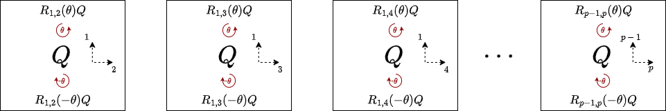
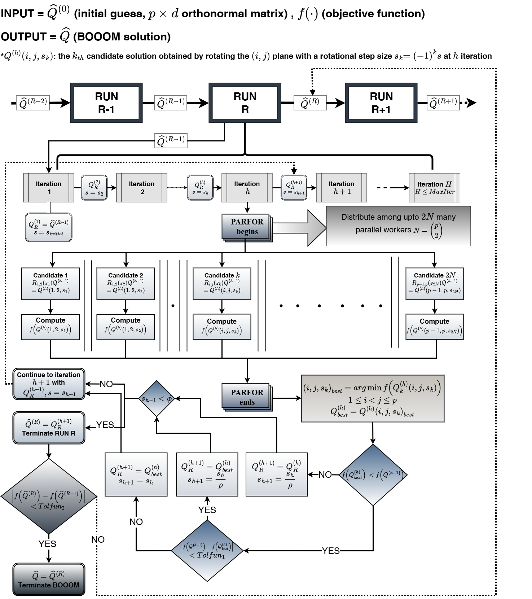

# BOOOM: Black-box Optimization over Orthonormal Manifolds

**BOOOM** (*Black-box Optimization over Orthonormal Manifolds*) is a general-purpose global optimization method for **orthonormal matrix estimation** under **any form of objective functions** including non-convex, multi-modal, non-differentiable objectives.

BOOOM performs optimization **directly on the Stiefel manifold**, ensuring feasibility (orthonormal columns) at every iteration, and leverages **Recursive Modified Pattern Search (RMPS)** to enable restart-based global exploration without requiring gradient or Hessian information.

---

## 📂 Repository Structure


```text
BOOOM/
├── Benchmark/                 # Benchmark experiments and comparisons
├── Real data analysis/        # Real-data application 
├── Simulation study1/         # Simulation: heterogeneous quadratic form analysis
├── Simulation study2/         # Simulation: low-rank and sparse decomposition analysis
├── figures/                   # Figures used in the paper/README (e.g., diagrams, flowcharts)
└── README.md                  # Main repository README
```


---

## 🔑 Key Features

- **Feasibility by construction**  
  Every iterate remains on the Stiefel manifold $\mathrm{St}(p,d)$.
  
- **Black-box optimization**  
  Requires only objective evaluations (no gradients/Hessians/smoothness assumptions).

- **Penalty-agnostic**  
  Supports user defined penalties, including convex and nonconvex penalties.

- **Global exploration**  
  Built-in restart and step-size reset mechanisms help escape poor local minima.

- **Parallelizable**  
  Candidate directions within an iteration can be evaluated independently.
  For a $p\times d$ orthonormal matrix, up to $p(p−1)$ coordinate directions can be evaluated simultaneously.
  
- **Scalable to high dimensions**  
  Designed to perform reliably in dimensional $(p \geq d)$.

---

## Notation note

The **Stiefel manifold** is the set of all matrices with orthonormal columns. 

Define $\mathrm{St}(p,d)=\lbrace Q\in ℝ^{p\times d}: Q^\top Q=I_d\,\rbrace$, i.e, the set of $p\times d$ (column) orthonormal matrices.

---


## 📌 Problem Setting

BOOOM addresses **general orthonormal matrix estimation problems** arising in high-dimensional statistics, machine learning, and signal processing, where the objective function may be non-convex, multi-modal, non-smooth, or available only as a black box. Such problems appear in a wide range of applications, including dimension reduction, subspace learning, matrix factorization, joint diagonalization, and low-rank structure estimation.

Rather than restricting attention to likelihood-based or differentiable formulations, BOOOM formulates orthonormal matrix estimation as a general constrained optimization problem over the Stiefel manifold, allowing the objective to encode arbitrary loss functions, penalties, or data-dependent criteria.

Specifically, let $Q$ denote an orthonormal  $p\times d$  matrix $p \geq d$.  
BOOOM solves optimization problems of the form:

<pre>
minimize   f(Q)
subject to Q ∈ St(p,d)
</pre>

where:

- **$f(\cdot)$** is a user specified real-valued objective function.

This formulation accommodates a broad class of objectives, including but not limited to:

- quadratic and non-quadratic loss functions,

- robust and truncated losses,

- non-smooth penalties,

- objectives defined implicitly through simulation, resampling, or external solvers.


The resulting optimization problem is typically non-convex and defined over a geometrically constrained parameter space, placing it out side the scope of classical gradint-based or smooth manifold optimization methods.

---


##   Method Overview

### Geometry preserving reparameteriation

BOOOM reparameterizes the Stiefel manifold using Givens rotation, converting maniold constrained optimization into a bounded search over rotation angles. 

Starting from a fixed orthonormal base matrix $Q_0 ∈ St(p,d)$, any point on $\mathrm{St}(p,d)$ can be reaced by premultiplying a finite sequence of Givens rotations,
each rotating two coordinate axes by an angle  $𝜃 ∈ (0, \pi)$

BOOOM represents **candidate solutions** as

$$Q_{new}= R_{ij}(\theta)Q_0,   1 \leq i < j \leq p$$

<p align="center">
  
</p>


Where Givens rotation is defined as

$$
R_{i,j}(\theta)=
\begin{bmatrix}
1 & \cdots & 0 &    \cdots    &     0   &     \cdots   & 0\\
\vdots & \ddots & \vdots &        &    \vdots    &        & \vdots\\
0 & \cdots & \cos\theta & \cdots & -\sin\theta     & \cdots & 0\\
\vdots &        & \vdots & \ddots & \vdots &        & \vdots\\
0 & \cdots & \sin\theta & \cdots & \cos\theta      & \cdots & 0\\
\vdots &        & \vdots &        & \vdots & \ddots & \vdots\\
0 & \cdots & 0 &      \cdots  &    0    &     \cdots   & 1
\end{bmatrix}_{p\times p}
$$

This parameterization:

- Preserves orthonormality by construction
- Converts manifold constraints into bounded scalar parameters


### Optimization via Recursive Modified Pattern Search (RMPS)

Once parameterized, BOOOM performs optimization using Recursive Modified Pattern Search (RMPS), a derivative-free global optimization algorithm.
RMPS explores the rotation parameters by:

- Evaluating coordinate-wise perturbations of rotation angles
- Recursively refining promising directions via step size reduction
- Parallel local searches in parameter space


The objective function is evaluated only at the matrix under the valid Stiefel manifold generated via rotations.


<p align="center">
  
</p>

---
##  Theoretical Guarantees


### Global convergence of BOOOM (restart-based)

Under mild regularity conditions on the objective function—specifically boundedness and continuity on the Stiefel manifold, together with local smoothness and second-order sufficiency near a global minimizer—BOOOM is guaranteed to achieve global convergence in probability. These guarantees do not rely on convexity and do not require gradient or Hessian information. Global exploration is achieved through restart-based derivative-free search over a compact rotation-parameter domain, enabling BOOOM to escape poor local minima even for highly non-convex objectives. 
