# BOOOM: Black-box Optimization over Orthonormal Manifolds

**BOOOM** (*Black-box Optimization over Orthonormal Manifolds*) is a general-purpose global optimization method for **orthonormal matrix estimation** for  **arbitary objective functions** including non-convex, multi-modal, non-differentiable objectives.

BOOOM performs optimization **directly on the Stiefel manifold**, ensuring feasibility (orthonormal columns) at every iteration, and leverages **Recursive Modified Pattern Search (RMPS)** to enable restart-based global exploration without requiring gradient or Hessian information.

---

## 📂 Repository Structure


```text
BOOOM/
├── ResNet exmaple/            # Illustration of BOOOM as a black-box optimization tool in deep networks (e.g., ResNet)
├── Benchmark experiments/     # Benchmark experiments and comparisons on various orthogonal optimization problems
├── Benchmark study/           # Benchmark experiments and comparisons on classical functions 
├── Real data analysis/        # Real-data application 
├── figures/                   # Figures used in the paper (e.g., diagrams, flowcharts)
└── README.md                  # Main repository README
```

---

## 🔑 Key Features

- **Feasibility by construction**  
  Every iterate remains on the Stiefel manifold $\mathrm{St}(p,d)$.
  
- **Black-box optimization**  
  Requires only objective evaluations (no gradients/Hessians/smoothness assumptions).

- **Penalty-agnostic**  
  Supports user-defined penalties, including convex and nonconvex penalties.

- **Global exploration**  
  Built-in restart and step-size reset mechanisms help escape poor local minima.

- **Parallelizable**  
  Candidate directions within an iteration can be evaluated independently.
  For a $p\times d$ orthonormal matrix, up to $p(p−1)$ coordinate directions can be evaluated simultaneously.
  
- **Scalable to high dimensions**  
  Designed to perform reliably when $(p \geq d)$.

---

## Notation note

The **Stiefel manifold** is the set of all matrices with orthonormal columns. 

Define $\mathrm{St}(p,d)=\lbrace Q\in ℝ^{p\times d}: Q^\top Q=I_d\,\rbrace$, i.e., the set of $p\times d$ (column) orthonormal matrices.

---

## 📌 Problem Setting

BOOOM addresses **general orthonormal matrix estimation problems** arising in high-dimensional statistics, machine learning, and signal processing, where the objective function may be non-convex, multi-modal, non-smooth, or available only as a black box. Such problems appear in a wide range of applications, including dimension reduction, subspace learning, matrix factorization, joint diagonalization, and low-rank structure estimation.

Rather than restricting attention to likelihood-based or differentiable formulations, BOOOM formulates orthonormal matrix estimation as a general constrained optimization problem over the Stiefel manifold, allowing the objective to encode arbitrary loss functions, penalties, or data-dependent criteria.

Specifically, let $Q$ denote an orthonormal  $p\times d$  matrix with $p \geq d$.  
BOOOM solves optimization problems of the form:

<pre>
minimize   f(Q)
subject to Q ∈ St(p,d)
</pre>

where:

- **$f(\cdot)$** is a user-specified real-valued objective function.

This formulation accommodates a broad class of objectives, including, but not limited to:

- quadratic and non-quadratic loss functions

- robust and truncated losses

- non-smooth penalties

- objectives defined implicitly through simulation, resampling, or external solvers


The resulting optimization problem is typically non-convex and defined over a geometrically constrained parameter space, placing it outside the scope of classical gradient-based or smooth manifold optimization methods.

---

## 🎯 Black-box Optimization via Orthogonal Transformations (ResNet Example)

To demonstrate the practical implications of BOOOM in a true black-box setting, consider a pretrained deep neural network (e.g., a ResNet classifier) where only forward predictions are available. In such settings, gradients, model parameters, and internal architecture are inaccessible, only input-output evaluations can be queried.

Let  
- $x \in \mathrm{R}^p$ denote an input (e.g., an image),  
- $g(x) = (p_1(x), …, p_C(x))$ denote the predicted class probabilities, where $p_j(x)$ is the probability assigned to class j and $∑_j p_j(x) = 1$,  
- y* denote the true class label.  

Instead of modifying the input arbitrarily, BOOOM considers structure-preserving orthogonal transformations of the form:

    x → R(U; x),   where U ∈ St(p, k)

Here, U is an orthonormal transformation (e.g., rotation or projection), ensuring that the transformation preserves geometric structure such as norms and relative relationships in the input space.

We define the following black-box objective function:

$$
f(U) = p_{y^\ast}(R(U; x)) - \max_{1 \leq j \leq C } p_j(R(U; x))
$$

### 🔍 Interpretation of the objective

- f(U) ∈ [−1, 1] measures how confidently the model predicts the true class relative to competing classes.  
- Minimizing f(U):
  - finds adversarial transformations that suppress the true class  
  - reveals worst-case behavior of the model under structured perturbations  
- Maximizing f(U):
  - finds transformations that enhance the true class prediction  
  - identifies robust or optimal viewpoints of the input  

### 🚀 Why this is important

- The objective is non-convex, highly non-linear, and derivative-inaccessible  
- Even small orthogonal transformations can induce large changes in prediction  
- Classical gradient-based adversarial methods cannot be applied here  
- BOOOM provides a general-purpose optimizer that:
  - works purely with function evaluations  
  - respects orthogonality constraints  
  - explores complex transformation spaces effectively  

<p align="center">
  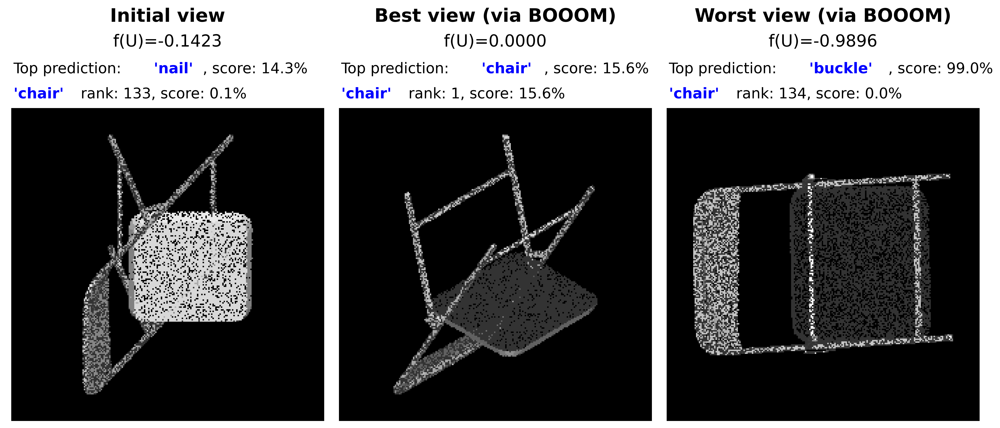
</p>

**Illustration:** Starting from an initial input (left), BOOOM searches over orthogonal transformations to identify  
(i) a transformation that maximizes confidence in the true class (center), and  
(ii) a transformation that minimizes it (adversarial view, right).  

This example highlights how BOOOM can serve as a general optimization engine for designing and optimizing novel objective functions, even when the model is treated as a complete black box.

---

##   Method Overview

### Geometry-preserving reparameteriation

BOOOM reparameterizes the Stiefel manifold using Givens rotations, converting manifold constrained optimization into a bounded search over rotation angles. 

Starting from a fixed orthonormal base matrix $Q_0 ∈ St(p,d)$, any point on $\mathrm{St}(p,d)$ can be reached by premultiplying a finite sequence of Givens rotations,
each rotating two coordinate axes by an angle  $𝜃 ∈ (0, \pi)$.

BOOOM represents **candidate solutions** as

$$Q_{new}= R_{ij}(\theta)Q_0,   1 \leq i < j \leq p$$

<p align="center">
  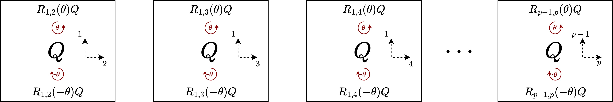
</p>


where A Givens rotation is defined as

$$
R_{i,j}(\theta)=
\begin{bmatrix}
1 & \cdots & 0 &    \cdots    &     0   &     \cdots   & 0\\
\vdots & \ddots & \vdots &        &    \vdots    &        & \vdots\\
0 & \cdots & \cos\theta & \cdots & -\sin\theta     & \cdots & 0\\
\vdots &        & \vdots & \ddots & \vdots &        & \vdots\\
0 & \cdots & \sin\theta & \cdots & \cos\theta      & \cdots & 0\\
\vdots &        & \vdots &        & \vdots & \ddots & \vdots\\
0 & \cdots & 0 &      \cdots  &    0    &     \cdots   & 1
\end{bmatrix}_{p\times p}
$$

This parameterization:

- Preserves orthonormality by construction
- Converts manifold constraints into bounded scalar parameters


### Optimization via Recursive Modified Pattern Search (RMPS)

Once parameterized, BOOOM performs optimization using Recursive Modified Pattern Search (RMPS), a derivative-free global optimization algorithm.
RMPS explores the rotation parameters by:

- Evaluating coordinate-wise perturbations of rotation angles
- Recursively refining promising directions via step size reduction
- Parallel local searches in parameter space


The objective function is evaluated only at matrices on the Stiefel manifold generated via rotations.


<p align="center">
  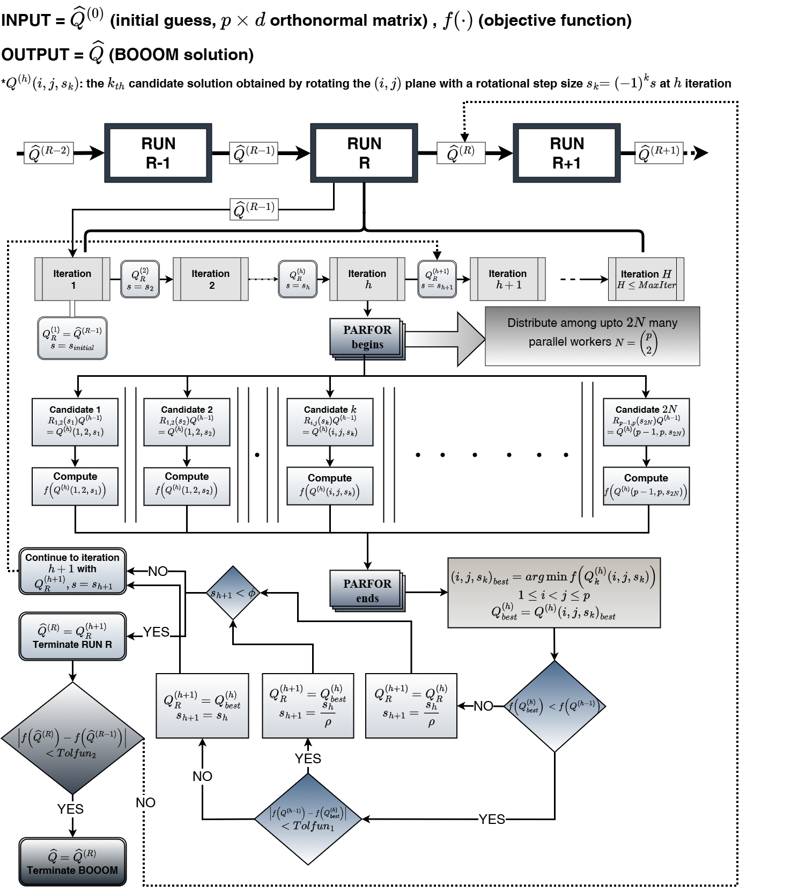
</p>

##  Theoretical Guarantees


### Global convergence of BOOOM (restart-based)

Under mild regularity conditions on the objective function—specifically boundedness and continuity on the Stiefel manifold, together with local smoothness and second-order sufficiency near a global minimizer—BOOOM is guaranteed to achieve global convergence in probability. These guarantees do not rely on convexity and do not require gradient or Hessian information. Global exploration is achieved through restart-based derivative-free search over a compact rotation-parameter domain, enabling BOOOM to escape poor local minima even for highly non-convex objectives. 


---
##  Benchmark experiments 1: Heterogeneous quadratic form analysis

This simulation study evaluates the performance of BOOOM and semidefinite programming (SDP) relaxation on a class of heterogeneous quadratic form optimization problems over the Stiefel manifold.

$$\max_{Q \in \mathrm{St}(p,d)} \ \sum_{i=1}^{d} q_i^\top M_i q_i$$

where $M_1,\ldots,M_d \succeq 0\$ for $\(p>d\)$, $Q=[q_1 \ \cdots \ q_d]\in ℝ^{p\times d}$.

Simulations are performed for two settings with $Q$:  $p\times d$ ∈ {($20\times 10$), ($50\times 40$)}. For each case, each matrix $M_i$ is $p\times p$.

The maximum value of objective funtion (Heterogeneous quadratic form) is summarized below.

<p align="center">
  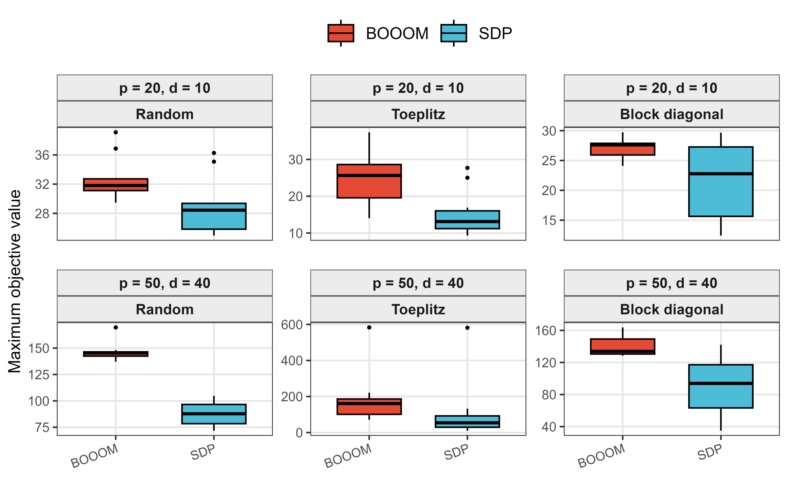
</p>


---
##  Benchmark experiments 2:  Low rank and Sparse Matrix Decomposition

This simulation study evaluates the performance of BOOOM and three algorithms for low rank and sparse matrix decomposition.

$$\min \Vert {L}\Vert_* + \lambda \Vert {S}\Vert_1, \text{ such that } {X} = {L} + {S}$$

$X = L + S$ where $X_{n\times p}$ is the original data,  $L_{n\times p}$ is low rank approximation with rank $d$ and $S_{n\times p}$ is a sparse matrix.

Simulations are conducted under multiple settings for $X$, with dimension $(n\times p)$ ∈ {($50\times 10$), ($70\times 20$), ($100\times 50$), ($100\times 100$)}.
For each dimensional setting, we consider two choices of the rank of the low-rank component, namely $d=5$ and $d=10$.

<p align="center">
  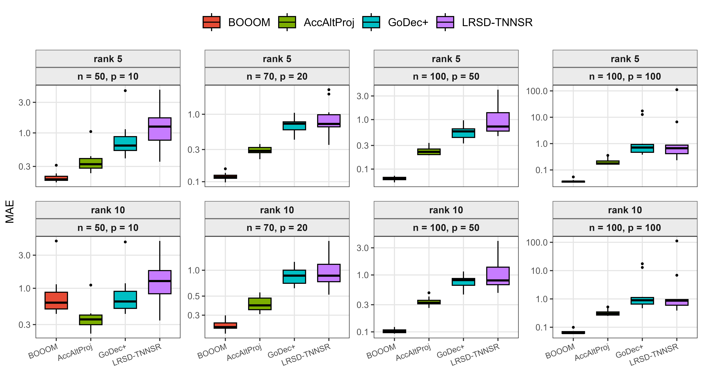
</p>

---
##  Benchmark experiments 3:  Independent Component Analysis

This simulation study evaluates the performance of BOOOM, FastICA, Infomax and Picard to solve the ICA problem.
Given an observed data matrix $X = AS$, the goal is to estimate an unmixing matrix $W$ to recover signals $\hat{S} = WX$ by maximizing the log-cosh contrast function as follows:

$$\max_{W \in \mathrm{St}(p,p)} \ \sum_{t=1}^{n} \sum_{i=1}^{p} \text{log cosh}(a_1 w_i^T x_t)$$

where $X\in  ℝ^{p\times n}$ is an observed data that constructed from an unknown mixing matrix $A \in  ℝ^{p\times p}$ and latent independent source signals $S \in  ℝ^{p\times n}$.
$w_i$ refers to the $i$-th row of W, $x_t$ represents the $t$-th observations and $a_i>0$ is fixed at 1 in this experiments.

Simulations are conducted under four dimension settings where the observed data matroix $X \in (p\times n)$ ∈ { $(20\times 50)$, $(20\times 200)$, $(50\times 125)$, $(50\times 500)$ }.

The Amari distance is used to assess and compare the accuracy of source recovery across the different methods.

<p align="center">
  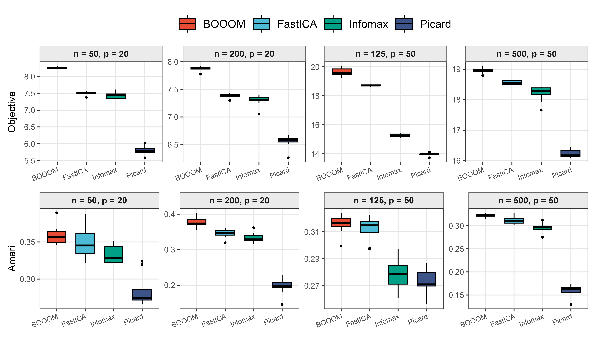
</p>

---
##  Benchmark experiments 4:  Varimax Factor Rotation

This simulation study evaluates the performance of BOOOM and the classic Varimax rotation function in matlab (rotatefactors) to find an orthogonal rotation matrix that maximizes the Varimax criterion.

Given a loading matrix $A \in  ℝ^{n\times p}$, the goal is to find an orthogonal rotation matrix $R \in St(p,p)$ such that the rotated loading matrix $B=AR$ has a simple and interpretable structure.  

The Varimax criterion is defined by,

$$ V(R) = \sum_{j=1}^{p} \left[\frac{1}{n}\sum_{k=1}^{n} B_{kj}^{4}- \left(\frac{1}{n}\sum_{k=1}^{n} B_{kj}^{2}\right)^2 \right] $$

In this implementation, we reformulate the problem as minimizing the objective function $-V(R)$

Simulations are conducted under eight dimension settings where the dimension of loading matrix $A$ $(n,p)$ ∈ { $(30, 5)$, $(60, 5)$, $(50, 10)$, $(100, 10)$ , $(80, 20)$, $(150, 20)$ , $(120, 30)$, $(200, 30)$ }.

<p align="center">
  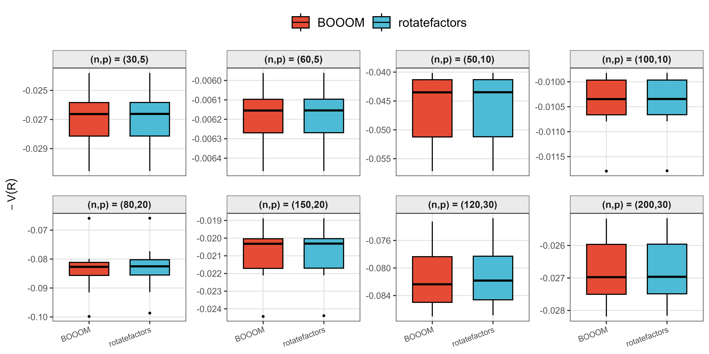
</p>

---
##  Benchmark experiments 5:  Orthogonal Joint Diagonalization 

This simulation study evaluates the performance of BOOOM, JacobiAJD, Riemannian gradient descent and Riemannian trust-region to solve OJD problem.

Given symmmetric matrices $C_1,..., C_m \in ℝ^{p\times p}$, the goal seeks an orthogonal matrix that makes a set of symmetric matrices simultaneously as diagonal as possible. The problem objective is formulated as 

$$\min_{W \in \mathrm{St}(p,p)} \ \sum_{k=1}^{m} \Vert \text{offdiag}(W^TC_kW)\Vert_F^{2}$$

$\text{offdiag}(\cdot)$ denotes the off-diagonal part of a matrix and $\Vert\cdot\Vert_F^{2}$ is the Frobenius norm.

Simulations are conducted under four dimension settings, specified by the the matrix dimension $p$ and the number of matrices $m$ $(p,m)$ ∈ { $(20, 5)$, $(20, 100)$, $(50, 5)$, $(50, 10)$ }.

<p align="center">
  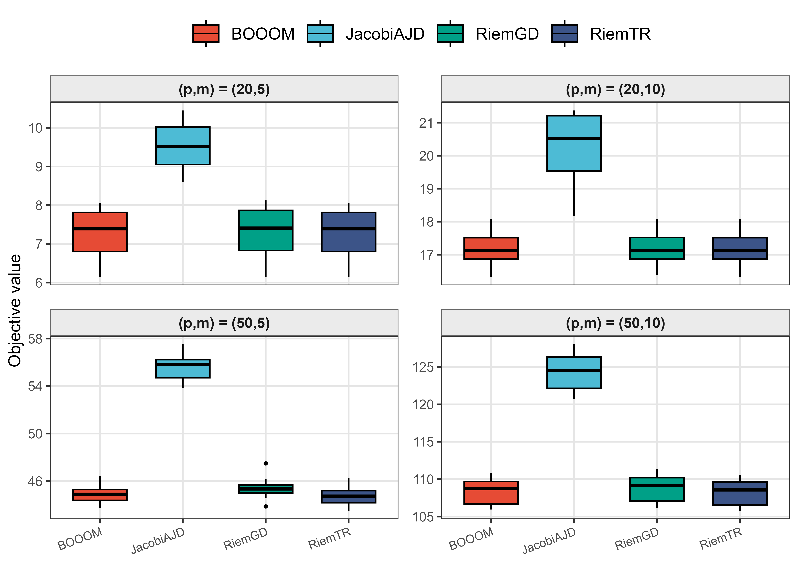
</p>

---
##  Benchmark experiments 6:  Reduced Kohn-Sham Rayleigh-Ritz Optimization

This experiment study evaluates the performance of BOOOM and Riemannian gradient descent on a reduced Kohn–Sham Rayleigh–Ritz optimization problem .

Given a Kohn-Sham Hamiltonian $H^*$ and an otrhonormal basis $B \in ℝ^{N_g\times p}$ for a reduced subspace, the projected Hamiltonian is defined by 

$$ H_{red} = B^TH^*B$$

The goal is to find an orthonormal matrix $Q \in St(p,d)$ that minimize 

$$ \min_{Q \in \mathrm{St}(p,d)} \text{tr}(Q^TH_{red}Q)   $$

Simulations are conducted under four reduced dimension settings $(p,d=2)$ ∈ { $(20, 2)$, $(50, 2)$, $(80, 2)$, $(100, 2)$ }.

<p align="center">
  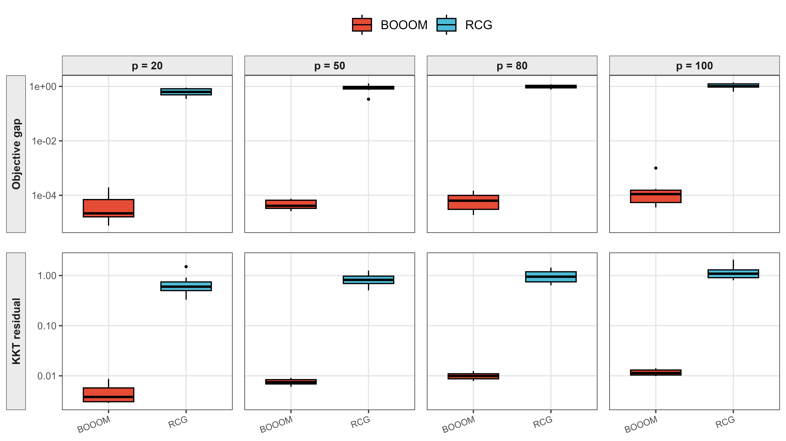
</p>


---
##  Case Study:  Profiling for Colorectal Cancer Association

In this case study, we identify metobolites associated with colorectal cancer (CRC) using supervised sparse principal component analysis. The goal is to select a sparse set of metabolites while maintaining strong discriminative power between healthy and cancer groups. The model uses two penalty terms: a sparsity penalty (to control the number of selected metabolites) and a discriminative penalty (to encourage separation between the two groups).

$$\min_{Q \in \mathrm{St}(p,d)}\ \parallel X - XQQ^\top \parallel_F^{2} + \lambda_1 \parallel Q\parallel_{2,1} + \lambda_2 \mathcal{L}_{\mathrm{Fisher}}(XQ, Y)$$

where $\parallel·\parallel_{2,1}$ represents $L_{2,1}$ norm and $\mathcal{L}_{\mathrm{Fisher}}$ denotes Fisher discriminant loss. $\lambda_1, \lambda_2 \in \lbrace 10^0,10^1 \ldots,10^8\ \rbrace$


Below is the pareto curve plot, showing the trade-off between misclassification rate and sparsity across different penalty parameter combinations.

<p align="center">
  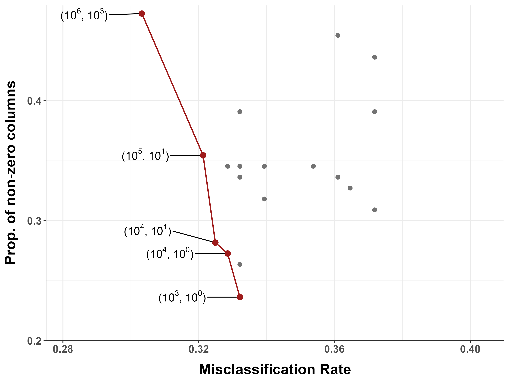
</p>


Below is the result for a selected optimal solution $(\lambda_1, \lambda_2): (10^6, 10^3)$, showing the top 20 metabolites ranked by importance.
The importance score is measured by $L_2$ norm of the solutioin $Q$. This measrues contribution of metabolites on $XQ$


<p align="center">
  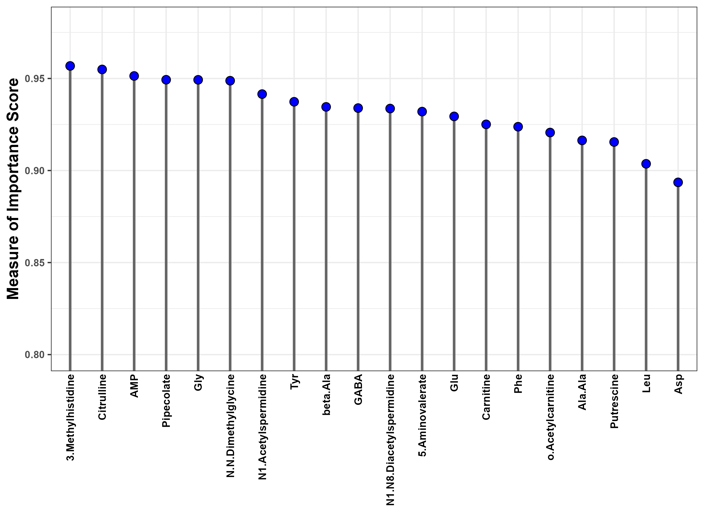
</p>


## 💬 Contact

For questions, please contact:  
**Beomchang Kim**  
[kimb12@vcu.edu](mailto:kimb12@vcu.edu)
